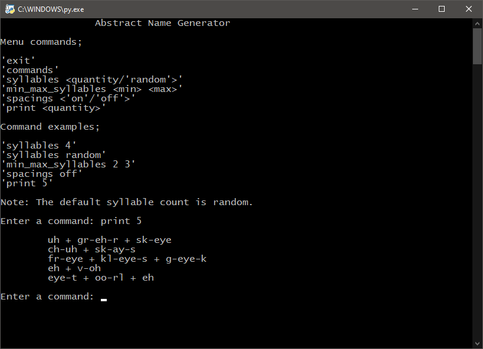

# AbstractNameGenerator

This script generates a permutation list of abstract syllable pronunciations and allows the user to vary the syllable count and the presentation in console.

The names can be used as is, or work as a pronunciation starting point for other names. This works well for naming characters, objects and environments if meaning is not of concern.